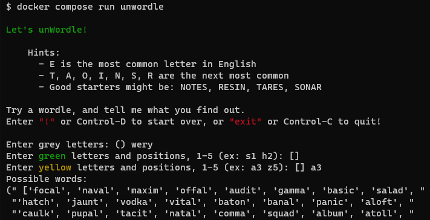

## UnWordle

Shamelessly cheat at [Wordle](https://www.powerlanguage.co.uk/wordle/) using Python and a word list.

Take a guess, and then use UnWordle to get suggestions as you progress.

Enter grey letters (bad guesses) all together. For example, if you guess `WEARY`, and only the `A` is in the word, you can respond:
`wery`

Enter Yellow or Green letters as pairs like `d4`. For example, if the `A` in `WEARY` is Yellow, you can respond:
`a3` -- since `A` is yellow in the `3`rd position



## Run with Docker

```
docker run -it --rm mshade/unwordle
```

## Build/Run with Docker locally

```
docker compose run unwordle
```

## Run with Python / venv

```
pip install -r requirements.txt
python unwordle.py
```
